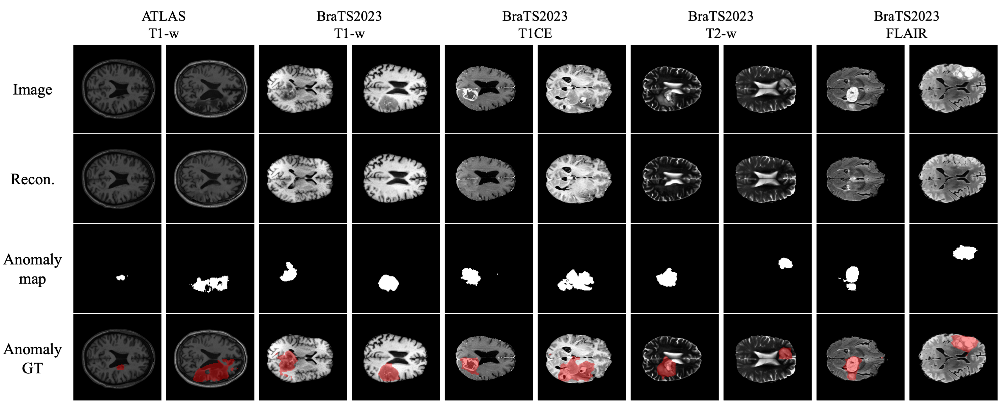

# MAD-AD
This Repository contains the PyTorch implementation of the submitted paper titled: "MAD-AD: Masked Diffusion Autoencoder for Unsupervised Brain Anomaly Detection"

## Setup

### Environment

We utilize the `Python 3.11` interpreter in our experiments. Install the required packages using the following command:
```bash
pip3 install -r requirements.txt
```

### Datasets
Prepare your data by registering to MNI_152_1mm and preprocessing, normalization, and extracting axial slices. Ensure that the training and validation sets consist only of normal, healthy data, while the test set should contain abnormal slices. Organize the files using the following structure:
```
├── Data
    ├── train
    │   ├── brain_scan_{train_image_id}_slice_{slice_idx}_{modality}.png
    │   ├── brain_scan_{train_image_id}_slice_{slice_idx}_brainmask.png
    │   └── ...
    ├── val
    │   ├── brain_scan_{val_image_id}_slice_{slice_idx}_{modality}.png
    │   ├── brain_scan_{val_image_id}_slice_{slice_idx}_brainmask.png
    │   └── ...
    └── test
    │   ├── brain_scan_{test_image_id}_slice_{slice_idx}_{modality}.png
    │   ├── brain_scan_{test_image_id}_slice_{slice_idx}_brainmask.png
    │   ├── brain_scan_{test_image_id}_slice_{slice_idx}_segmentation.png
        └── ...

```

## train and fine-tune VAE

Follow [LDM-VAE](https://github.com/CompVis/latent-diffusion?tab=readme-ov-file#training-autoencoder-models) to fine-tune and adapt the RGB pre-trained models for medical images. Script "finetune_VAE.py" is prepared to adapt the 3-channel pre-trained model weights (KL-F8) for 1-channel medical images. The link to fintuned medical-VAE saved weight will be provided upon acceptance (due to the need for being anonymous). 

## Train

Train our RLR with the following command:

```bash
torchrun train_MAD_AD.py \
            --dataset Bra \
            --model UNet_L \
            --mask-random-ratio True \
            --object-category all  \
            --image-size 288 \
            --center-size 256 \
            --center-crop True \
            --augmentation True \
            --ckpt-every 20 
```

## Test

Test the model with the following command:

```bash
python evaluate_MAD_AD.py \
            --dataset mvtec \
            --model UNet_L \
            --object-category all  \
            --image-size 288 \
            --center-size 256 \
            --center-crop True \
            --augmentation True \
```
## Sample Results


