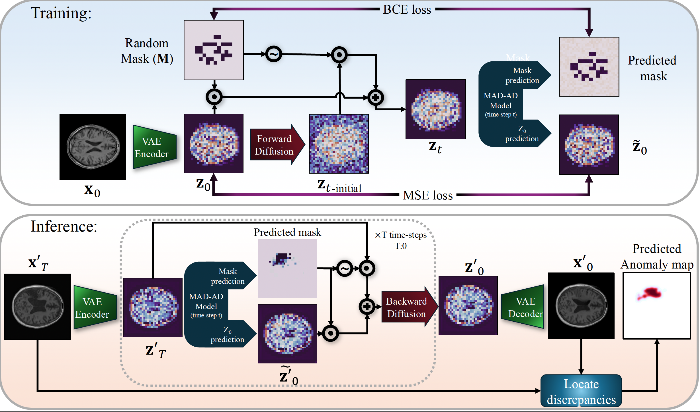
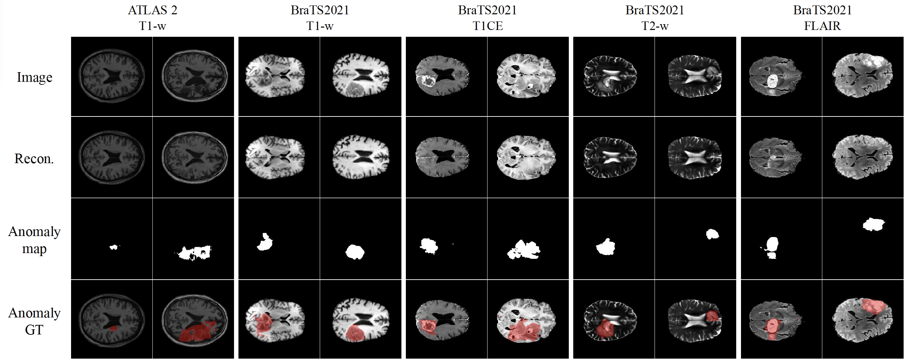

# ✨ MAD-AD ✨
**A PyTorch Implementation for Unsupervised Brain Anomaly Detection**

This repository hosts the official PyTorch implementation for our paper accepted in IPMI2025:  
["MAD-AD: Masked Diffusion for Unsupervised Brain Anomaly Detection"](https://arxiv.org/abs/2502.16943).

---

## 🎨 Approach



---

## ⚙️ Setup

### 🛠️ Environment

Our experiments run on **Python 3.11**. Install all the required packages by executing:

```bash
pip3 install -r requirements.txt
```

### 📁 Datasets

Prepare your data as follows:

1. **Data Registration & Preprocessing:**  
   - Register with MNI_152_1mm.
   - Preprocess, normalize, and extract axial slices.

2. **Dataset Organization:**  
   - Ensure **training** and **validation** sets contain only normal, healthy data.
   - **Test** set should include abnormal slices.
   - Organize your files using this structure:

   ```
   ├── Data
       ├── train
       │   ├── brain_scan_{train_image_id}_slice_{slice_idx}_{modality}.png
       │   ├── brain_scan_{train_image_id}_slice_{slice_idx}_brainmask.png
       │   └── ...
       ├── val
       │   ├── brain_scan_{val_image_id}_slice_{slice_idx}_{modality}.png
       │   ├── brain_scan_{val_image_id}_slice_{slice_idx}_brainmask.png
       │   └── ...
       └── test
           ├── brain_scan_{test_image_id}_slice_{slice_idx}_{modality}.png
           ├── brain_scan_{test_image_id}_slice_{slice_idx}_brainmask.png
           ├── brain_scan_{test_image_id}_slice_{slice_idx}_segmentation.png
           └── ...
   ```

---

## 🔧 Pretrained Weights & VAE Fine-Tuning

### Pretrained VAE Models

To jumpstart your experiments, we provide pretrained weights adapted for 1-channel medical brain images. These models are available on [HuggingFace](https://huggingface.co/farzadbz/Medical-VAE).

### Train & Fine-Tune VAE

If you prefer to train your own VAE from scratch, please refer to the [LDM-VAE repository](https://github.com/CompVis/latent-diffusion?tab=readme-ov-file#training-autoencoder-models) for detailed instructions.

---

## 🚄 Training MAD-AD

To train MAD-AD, run the following command. This configuration leverages a UNet_L model with data augmentation and integrates the pretrained VAE:

```bash
torchrun train_MAD_AD.py \
            --model UNet_L \
            --mask-random-ratio True \
            --image-size 256 \
            --augmentation True \
            --vae_path checkpoints/klf8_medical.ckpt \
            --train_data_root ./data/train/ \
            --val_data_root ./data/val/ \
            --modality T1 \
            --ckpt-every 20 
```

---

## 📸 Sample Results




---

## 📚 Citation & Reference

If you find MAD-AD useful in your research, please cite our work:

```bibtex
@article{beizaee2025mad,
  title={MAD-AD: Masked Diffusion for Unsupervised Brain Anomaly Detection},
  author={Beizaee, Farzad and Lodygensky, Gregory and Desrosiers, Christian and Dolz, Jose},
  journal={arXiv preprint arXiv:2502.16943},
  year={2025}
}
```

